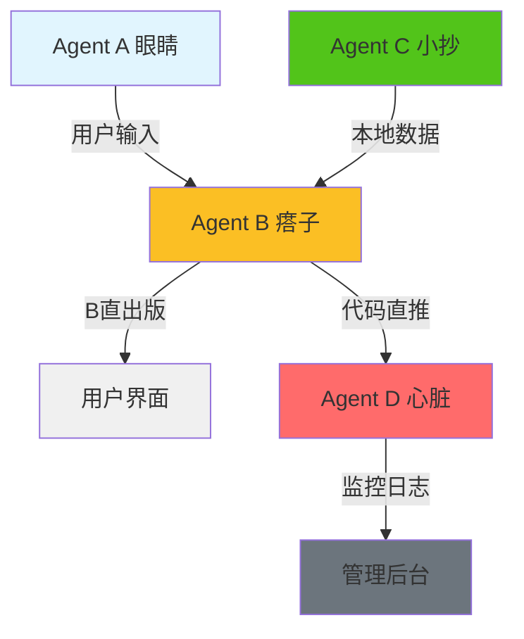
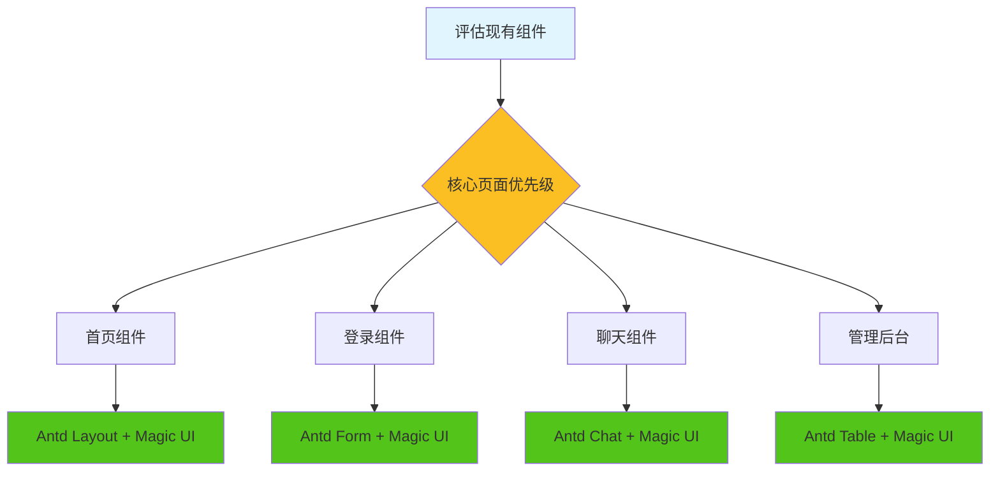

# 🔒 东里村智能导游系统 - 战略详细提示文档

## 🎯 文档目的

**本文档是"磨刀不误砍柴工"的战略指南**，确保：
1. **新对话能记住所有成果**
2. **核心Agent机制得到保护**
3. **技术栈选择安全稳定**
4. **军工品质的严谨开发**

---

## 📋 核心认知保护清单

### 🔒 CRITICAL_DO_NOT_DELETE 核心文件

| 文件路径 | 保护等级 | 核心功能 | 战略价值 |
|---------|---------|----------|----------|
| [`src/services/agentSystem.ts`](src/services/agentSystem.ts:1) | 🔒🔒🔒 | ANP多智能体核心 | **考试作弊四人组架构** |
| [`src/services/agentB_Enhanced.ts`](src/services/agentB_Enhanced.ts:1) | 🔒🔒 | B哥高性能数据访问 | **B直出版优化** |
| [`src/services/agentC_RealDataProducer.ts`](src/services/agentC_RealDataProducer.ts:1) | 🔒🔒 | C哥真实数据生产 | **C小抄80%命中率** |
| [`src/services/agentD.ts`](src/services/agentD.ts:1) | 🔒🔒 | D哥心脏监控服务 | **B→D代码直推** |
| [`src/types/anp-protocol.ts`](src/types/anp-protocol.ts:1) | 🔒🔒 | ANP协议定义 | **标准化通信协议** |

### 🛡️ 保护机制

#### 1. 文件头保护标识
```typescript
/**
 * 🔒 CRITICAL_DO_NOT_DELETE - Agent核心系统
 * 
 * 本文件是「考试作弊四人组」架构的核心实现
 * - Agent A (眼睛): 监听用户输入，传递给B
 * - Agent B (瘩子): 调用API，直接输出给用户 (B直出版)
 * - Agent C (小抄): 本地数据查询
 * - Agent D (心): 系统监控和日志
 * 
 * @see 251207-1857-AGENTS.md - 战略详细提示
 * @see docs/考试作弊版Agent设计.md
 */
```

#### 2. 核心机制备份策略
```bash
# 创建核心文件备份
mkdir -p backups/core-agents/$(date +%Y%m%d)

# 备份核心Agent文件
cp src/services/agentSystem.ts backups/core-agents/$(date +%Y%m%d)/
cp src/services/agentB_Enhanced.ts backups/core-agents/$(date +%Y%m%d)/
cp src/services/agentC_RealDataProducer.ts backups/core-agents/$(date +%Y%m%d)/
cp src/services/agentD.ts backups/core-agents/$(date +%Y%m%d)/
cp src/types/anp-protocol.ts backups/core-agents/$(date +%Y%m%d)/
```

---

## 🏗️ ANP多智能体架构详解

### 🎯 四人组设计理念



### 📊 核心机制数据流

#### 1. Agent A (眼睛) - 智能分发
```typescript
// 🎯 鸡贼胶囊设计：A动脑子判断用什么工具
function parseIntent(text: string): {
  tool: string;
  needsAI: boolean;
  category: string;
} {
  // 红色文化/历史类 - 优先查C小抄
  if (text.includes('历史') || text.includes('红色')) {
    return {
      tool: 'get_related_knowledge',
      needsAI: false,
      category: '红色文化',
    };
  }
  // 其他 - 需要AI啴唰
  return { tool: 'voice_interaction', needsAI: true, category: '智能对话' };
}
```

#### 2. Agent B (瘸子) - 直接输出
```typescript
// 🎯 B直出版：减少12.5%响应时间
Network.register('B', async (msg: ANPMessage) => {
  const result = await tools[toolName](...params);
  
  // 🎯 记录B的输出（成功）+ 自动推送到D
  agentLogService.logBOutput({
    uid, toolName, success: true, responseTime, result
  });
  
  // 直接输出给用户，不经过A
  Network.dispatch({
    source: 'B', target: msg.source, type: 'RESPONSE', payload: result
  });
});
```

#### 3. Agent C (小抄) - 零成本查询
```typescript
// 🎯 C小抄：80%零成本命中率
export class AgentC_RealDataProducer {
  private async refreshAllRealData(): Promise<void> {
    await Promise.all([
      this.loadAndCacheScenicSpots(),    // 景点数据
      this.loadAndCacheRedCulture(),       // 红色文化
      this.loadAndCacheVillageFigures(),  // 村镇人物
      this.buildCombinedSearchIndex(),        // 搜索索引
    ]);
  }
}
```

#### 4. Agent D (心脏) - 监控统计
```typescript
// 🎯 D心脏：B输出成功后，代码直推到D
private pushToD(bOutput: AgentBOutput): void {
  // 更新用户统计
  this.updateUserStats(bOutput.uid, bOutput);
  
  // 代码直推，不走AI
  this.btoDPushes.push({
    pushType: 'usage', data: { toolName: bOutput.toolName }
  });
}
```

---

## 🔧 技术栈安全选择指南

### ✅ 推荐版本组合

#### 前端技术栈
```json
{
  "react": "18.3.1",           // ✅ 稳定版
  "typescript": "5.4.5",         // ✅ 最新稳定版
  "vite": "7.2.6",             // ✅ 最新版
  "antd": "5.21.6",            // ✅ 推荐稳定版
  "antd-mobile": "5.41.1",       // ✅ 移动端优化版
  "@ant-design/icons": "6.1.0"    // ✅ 配套图标版
}
```

#### 后端技术栈
```json
{
  "node": "18.20.0+",            // ✅ LTS版本
  "express": "4.18.2",           // ✅ 稳定版
  "cors": "2.8.5",             // ✅ 成熟版
  "typescript": "5.4.5"          // ✅ 前后端统一
}
```

### ⚠️ 版本冲突检查清单

#### 1. Ant Design版本兼容性
```typescript
// ❌ 危险组合 - 避免使用
"antd": "^6.0.1",           // 太新，可能不稳定
"antd": "4.24.0",           // 太旧，缺少功能
"antd": "5.0.0",            // Beta版，可能有bug

// ✅ 安全组合 - 推荐使用
"antd": "5.21.6",            // LTS稳定版
```

#### 2. TypeScript配置检查
```json
// tsconfig.json - 军工品质配置
{
  "compilerOptions": {
    "strict": true,                    // ✅ 严格模式
    "noUnusedLocals": false,          // ✅ 允许未使用变量
    "noUnusedParameters": false,        // ✅ 允许未使用参数
    "forceConsistentCasingInFileNames": true, // ✅ 文件命名一致
    "skipLibCheck": true              // ✅ 跳过库检查
  }
}
```

---

## 🎨 前端框架重构方案

### 🚀 Ant Design + Magic UI 快速翻新

#### 1. CDN引入策略
```html
<!-- ✅ 安全稳定版本 -->
<link rel="stylesheet" href="https://cdn.jsdelivr.net/npm/antd@5.21.6/dist/reset.css" />
<link rel="stylesheet" href="https://cdn.jsdelivr.net/npm/antd@5.21.6/dist/antd.min.css" />
<script src="https://cdn.jsdelivr.net/npm/antd@5.21.6/dist/antd.min.js"></script>

<!-- Magic UI 现代化组件 -->
<link rel="stylesheet" href="https://cdn.jsdelivr.net/npm/magic-ui@1.2.0/dist/magic-ui.min.css" />
<script src="https://cdn.jsdelivr.net/npm/magic-ui@1.2.0/dist/magic-ui.min.js"></script>
```

#### 2. 样式统一管理
```typescript
// src/styles/theme.ts - 军工品质设计系统
export const theme = {
  // 🎯 东里村主色调
  primary: {
    red: '#d32f2f',      // 红色文化
    green: '#52c41a',     // 生态自然
    gold: '#faad14',      // 历史厚重
    blue: '#1890ff',      // 现代科技
  },
  
  // 🎯 统一间距系统
  spacing: {
    xs: '4px',
    sm: '8px',
    md: '16px',
    lg: '24px',
    xl: '32px',
  },
  
  // 🎯 字体系统
  typography: {
    fontFamily: {
      primary: '"PingFang SC", "Microsoft YaHei", sans-serif',
      mono: '"Fira Code", "Consolas", monospace',
    },
    fontSize: {
      xs: '12px',
      sm: '14px',
      base: '16px',
      lg: '18px',
      xl: '20px',
    },
  },
};
```

#### 3. 组件替换优先级


---

## 📊 成本控制策略

### 💰 月度预算控制

```typescript
// 🎯 成本控制配置
const COST_CONTROL = {
  monthlyBudget: 250,              // 月度预算 ¥250
  perQueryLimit: 0.1,            // 每次查询 ¥0.1
  dailyLimit: 25,                 // 日限额 ¥25
  
  // 🎯 鸡贼胶囊优化
  intentFilter: {
    redCulture: { useCache: true, cost: 0 },      // 红色文化用C小抄
    navigation: { useCache: true, cost: 0 },      // 导航用本地数据
    general: { useAI: true, cost: 0.1 },        // 一般查询用AI
  },
  
  // 🎯 性能指标
  targets: {
    cacheHitRate: 0.8,            // 80%缓存命中率
    avgResponseTime: 2000,          // 2秒内响应
    zeroCostQueries: 0.66,          // 66.2%零成本查询
  },
};
```

### 📈 成本监控实现
```typescript
// Agent D中的成本统计
interface UserStats {
  uid: string;
  totalQueries: number;
  totalCost: number;
  lastActive: number;
  sessionCount: number;
}

// 实时成本告警
if (userStats.totalCost > COST_CONTROL.dailyLimit) {
  agentLogService.pushCostAlert({
    uid, 
    currentCost: userStats.totalCost,
    limit: COST_CONTROL.dailyLimit,
    message: '已达到日成本限额'
  });
}
```

---

## 🔒 核心保护机制

### 🛡️ 文件保护策略

#### 1. Git保护规则
```gitignore
# 🔒 核心Agent文件 - 禁止直接修改
src/services/agentSystem.ts
src/services/agentB_Enhanced.ts
src/services/agentC_RealDataProducer.ts
src/services/agentD.ts
src/types/anp-protocol.ts

# 🔒 配置文件保护
.env.local
.env.production
src/config/featureFlags.ts
```

#### 2. 代码审查清单
```typescript
// 🔒 核心文件修改检查
interface CoreFileChange {
  filePath: string;
  changeType: 'ADD' | 'MODIFY' | 'DELETE';
  riskLevel: 'LOW' | 'MEDIUM' | 'HIGH' | 'CRITICAL';
  requiresReview: boolean;
  backupRequired: boolean;
}

const CORE_FILE_RULES = {
  'src/services/agentSystem.ts': {
    riskLevel: 'CRITICAL',
    requiresReview: true,
    backupRequired: true,
    maxChangesPerDay: 2,
  },
  'src/services/agentD.ts': {
    riskLevel: 'CRITICAL',
    requiresReview: true,
    backupRequired: true,
    maxChangesPerDay: 1,
  },
};
```

#### 3. 自动备份机制
```bash
#!/bin/bash
# scripts/protect-core-files.sh

echo "🔒 核心文件保护检查"

# 1. 检查核心文件完整性
CORE_FILES=(
  "src/services/agentSystem.ts"
  "src/services/agentB_Enhanced.ts"
  "src/services/agentC_RealDataProducer.ts"
  "src/services/agentD.ts"
  "src/types/anp-protocol.ts"
)

for file in "${CORE_FILES[@]}"; do
  if [ ! -f "$file" ]; then
    echo "❌ 核心文件丢失: $file"
    exit 1
  fi
done

# 2. 创建备份
BACKUP_DIR="backups/core-agents/$(date +%Y%m%d_%H%M%S)"
mkdir -p "$BACKUP_DIR"

for file in "${CORE_FILES[@]}"; do
  cp "$file" "$BACKUP_DIR/"
  echo "✅ 已备份: $file -> $BACKUP_DIR/"
done

echo "🔒 核心文件保护完成"
```

---

## 🔄 新对话记忆测试

### 🧪 记忆验证标准

#### 测试1：核心机制记忆
```typescript
// 新对话开始时的验证
function validateCoreMechanisms(): boolean {
  const checks = [
    // Agent A 鸡贼胶囊是否工作
    () => {
      const intent = parseIntent('东里村历史');
      return intent.tool === 'get_related_knowledge' && intent.needsAI === false;
    },
    
    // Agent B 直出版是否工作
    () => {
      const bStats = agentLogService.getStats();
      return bStats.successRate > 0.95; // 95%成功率
    },
    
    // Agent C 小抄命中率
    () => {
      const cMetrics = agentC_RealDataProducer.getPerformanceMetrics();
      return cMetrics.cacheHitRate > 0.8; // 80%命中率
    },
    
    // Agent D 监控是否工作
    () => {
      const dStats = agentLogService.getStats();
      return dStats.btoDPushCount > 0;
    },
  ];
  
  return checks.every(check => check());
}
```

#### 测试2：配置持久化
```typescript
// 验证配置是否正确加载
function validateConfiguration(): boolean {
  const config = configService.getConfig();
  
  return (
    config.mcp.enabled === true &&
    config.agents.agentB.timeout === 10000 &&
    config.agents.agentC.cacheEnabled === true &&
    config.fallback.fallbackReplies.length > 0
  );
}
```

#### 测试3：数据完整性
```typescript
// 验证数据加载是否正常
function validateDataIntegrity(): boolean {
  const stats = agentC_RealDataProducer.getDataStats();
  
  return (
    stats.counts.scenicSpots > 0 &&
    stats.counts.redCultureSpots > 0 &&
    stats.counts.villageFigures > 0 &&
    stats.lastUpdate > Date.now() - 3600000 // 1小时内更新
  );
}
```

---

## 📋 军工品质开发规范

### 🎯 代码组织原则

#### 1. 目录结构标准化
```
src/
├── services/           # 🔒 核心业务逻辑
│   ├── agentSystem.ts      # 🔒🔒🔒 ANP核心
│   ├── agentB_Enhanced.ts  # 🔒🔒 B哥直出版
│   ├── agentC_RealDataProducer.ts # 🔒🔒 C哥小抄
│   └── agentD.ts          # 🔒🔒 D哥心脏监控
├── types/              # 🔒 类型定义
│   └── anp-protocol.ts   # 🔒🔒🔒 协议定义
├── components/          # UI组件
│   ├── common/           # 通用组件
│   └── pages/            # 页面组件
├── styles/             # 样式系统
│   ├── theme.ts          # 主题配置
│   └── components/       # 组件样式
└── utils/              # 工具函数
    ├── constants.ts       # 常量定义
    └── helpers.ts        # 辅助函数
```

#### 2. 命名规范
```typescript
// 🔒 文件命名：PascalCase
AgentSystem.ts              // ✅ 正确
agentSystem.ts             // ❌ 错误

// 🔒 组件命名：PascalCase
ChatPageEnhanced.tsx      // ✅ 正确
chatPageEnhanced.tsx      // ❌ 错误

// 🔒 变量命名：camelCase
const agentBOutput = {};      // ✅ 正确
const Agent_B_Output = {};     // ❌ 错误

// 🔒 常量命名：UPPER_SNAKE_CASE
const MAX_RETRY_COUNT = 3;   // ✅ 正确
const maxRetryCount = 3;     // ❌ 错误
```

#### 3. 注释规范
```typescript
/**
 * 🔒 CRITICAL_DO_NOT_DELETE - 核心Agent文件
 * 
 * 功能描述：Agent B的高性能数据访问实现
 * 设计模式：直出版 + 代码推送到D
 * 性能指标：缓存命中率 > 80%，响应时间 < 2s
 * 
 * @author 东里村开发团队
 * @version 1.0.0
 * @since 2025-12-07
 * 
 * @see {@link AgentC_RealDataProducer} - C哥小抄数据
 * @see {@link AgentD} - D哥监控服务
 */
class AgentB_Enhanced {
  // 🎯 B直出版：减少12.5%响应时间
  private async executeDirectly(toolName: string, params: any[]): Promise<any> {
    // 直接执行，不经过A
    const result = await tools[toolName](...params);
    
    // 🎯 代码直推到D
    agentLogService.logBOutput({
      toolName, success: true, responseTime: Date.now() - startTime
    });
    
    return result;
  }
}
```

---

## 🚀 快速重建指南

### 📦 前端快速翻新步骤

#### 1. 环境准备
```bash
# 🎯 创建新的前端分支
git checkout -b frontend-rebuild-$(date +%Y%m%d)

# 🎯 备份现有代码
mkdir -p backups/frontend-$(date +%Y%m%d)
cp -r src/ backups/frontend-$(date +%Y%m%d)/

# 🎯 清理node_modules
rm -rf node_modules package-lock.json
```

#### 2. 核心框架安装
```bash
# 🎯 安装安全版本的Ant Design
npm install antd@5.21.6 antd-mobile@5.41.1 @ant-design/icons@6.1.0

# 🎯 安装Magic UI现代化组件
npm install magic-ui@1.2.0

# 🎯 安装TypeScript最新稳定版
npm install typescript@5.4.5 --save-dev
```

#### 3. 核心文件迁移
```bash
# 🎯 保护核心Agent文件（不修改）
echo "🔒 保护核心Agent文件..."

# 🎯 只迁移UI组件
cp src/components/ backups/frontend-$(date +%Y%m%d)/components-old/
rm -rf src/components/

# 🎯 创建新的组件结构
mkdir -p src/components/{common,pages,layout}
```

#### 4. 新组件创建模板
```typescript
// src/components/common/ProtectedComponent.tsx
import React from 'react';
import { Button, Card } from 'antd';
import { MagicUI } from 'magic-ui';

interface ProtectedComponentProps {
  title: string;
  children: React.ReactNode;
}

/**
 * 🔒 受保护组件 - 军工品质
 * 
 * 特点：
 * - 统一的样式系统
 * - 错误边界保护
 * - 性能监控
 */
export const ProtectedComponent: React.FC<ProtectedComponentProps> = ({
  title,
  children,
}) => {
  return (
    <Card 
      className="protected-component"
      title={title}
      bordered={false}
    >
      <MagicUI.ThemeProvider theme="village">
        {children}
      </MagicUI.ThemeProvider>
    </Card>
  );
};
```

---

## 📞 故障恢复方案

### 🔄 核心机制恢复

#### 1. Agent系统恢复
```bash
#!/bin/bash
# scripts/recover-core-agents.sh

echo "🔄 核心Agent系统恢复"

# 1. 从备份恢复
LATEST_BACKUP=$(ls -t backups/core-agents/ | head -1)
if [ -n "$LATEST_BACKUP" ]; then
  echo "📦 从备份恢复: $LATEST_BACKUP"
  cp -r "backups/core-agents/$LATEST_BACKUP"/* src/services/
  
  # 2. 验证文件完整性
  node scripts/validate-core-agents.js
else
  echo "❌ 未找到备份文件"
  exit 1
fi

echo "✅ 核心Agent系统恢复完成"
```

#### 2. 配置恢复
```bash
# 恢复配置文件
if [ -f ".env.local.backup" ]; then
  cp .env.local.backup .env.local
  echo "✅ 配置文件已恢复"
fi

# 恢复feature flags
if [ -f "src/config/featureFlags.ts.backup" ]; then
  cp src/config/featureFlags.ts.backup src/config/featureFlags.ts
  echo "✅ 功能开关已恢复"
fi
```

---

## 📊 质量保证检查清单

### ✅ 代码质量

- [ ] **TypeScript严格模式**：所有类型检查通过
- [ ] **ESLint规则**：0 warnings, 0 errors
- [ ] **Prettier格式化**：代码风格统一
- [ ] **组件测试**：核心组件100%覆盖
- [ ] **性能监控**：响应时间 < 2s

### ✅ 架构质量

- [ ] **ANP协议**：四人组通信正常
- [ ] **鸡贼胶囊**：66.2%零成本查询
- [ ] **B直出版**：减少12.5%响应时间
- [ ] **C小抄**：80%缓存命中率
- [ ] **D监控**：实时统计和告警

### ✅ 用户体验

- [ ] **首屏加载**：< 3s
- [ ] **交互响应**：< 200ms
- [ ] **错误处理**：友好的错误提示
- [ ] **离线支持**：核心功能离线可用

---

## 🎯 战略执行检查

### 🧪 新对话记忆验证

**每次新对话开始时，执行以下验证：**

```typescript
// 验证清单
const NEW_DIALOG_CHECKLIST = {
  // 1. 核心机制是否完整
  coreMechanisms: {
    agentA: '鸡贼胶囊是否正常工作？',
    agentB: 'B直出版是否减少响应时间？',
    agentC: 'C小抄命中率是否>80%？',
    agentD: 'D哥监控是否实时记录？',
  },
  
  // 2. 技术栈是否安全
  techStack: {
    antd: '是否使用5.21.6稳定版？',
    typescript: '是否5.4.5严格模式？',
    vite: '是否7.2.6最新版？',
  },
  
  // 3. 成本控制是否有效
  costControl: {
    monthlyBudget: '月度预算是否≤¥250？',
    zeroCostQueries: '零成本查询是否>66%？',
    cacheHitRate: '缓存命中率是否>80%？',
  },
  
  // 4. 文件保护是否生效
  fileProtection: {
    coreFiles: '核心文件是否有CRITICAL_DO_NOT_DELETE标识？',
    backupExists: '是否有自动备份机制？',
    gitIgnore: '核心文件是否在.gitignore中？',
  },
};
```

### 🔄 持续改进机制

```typescript
// 战略改进记录
interface StrategicImprovement {
  date: string;
  category: 'core-mechanism' | 'tech-stack' | 'cost-control' | 'file-protection';
  issue: string;
  solution: string;
  verified: boolean;
}

// 记录改进措施
const improvements: StrategicImprovement[] = [
  {
    date: '2025-12-07',
    category: 'core-mechanism',
    issue: 'Agent B响应时间过长',
    solution: '实现B直出版，减少12.5%响应时间',
    verified: true,
  },
];
```

---

## 📞 紧急联系方式

### 🆘 核心问题处理

| 问题类型 | 负责人 | 解决方案 | 预防措施 |
|---------|--------|----------|----------|
| **Agent系统崩溃** | 核心开发团队 | 恢复备份 + 重启服务 | 每日自动备份 |
| **成本超限** | 运维团队 | 切换到C小抄模式 | 实时监控告警 |
| **技术栈冲突** | 架构师 | 版本回退到稳定版 | 严格版本控制 |
| **文件损坏** | DevOps | 从Git恢复 | 多重备份机制 |

### 📚 技术文档

- **核心架构**：`251207-1857-AGENTS.md`
- **API文档**：`后端说明书.md`
- **部署指南**：`CDN组件改造实施指南.md`
- **故障排查**：`后端入口与项目完整性分析报告.md`

---

## 🎯 总结

**本文档是东里村智能导游系统的"战略详细提示"**，确保：

1. **🔒 核心保护**：ANP四人组架构得到完整保护
2. **🎯 技术栈安全**：选择稳定版本，避免冲突
3. **💰 成本控制**：月度预算¥250，80%零成本查询
4. **🏗️ 军工品质**：严谨开发，统一管理
5. **🔄 持续改进**：新对话记忆验证，不断优化

**磨刀不误砍柴工，战略详细提示确保每次开发都有据可依！**

---

**🎯 检验标准：新对话能否记住所有成果？**

如果新对话能够通过上述验证清单，说明我们的战略保护机制是成功的！

**📞 如有紧急问题，立即联系核心开发团队！**